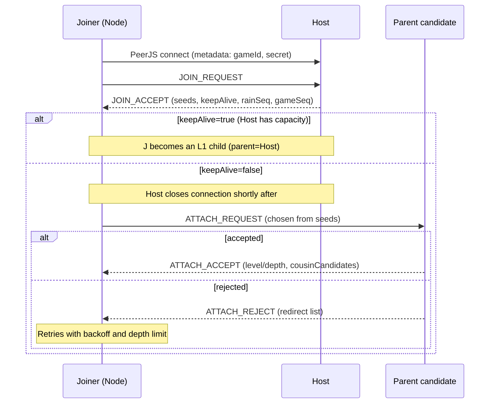

# @game-p2p/protocol

Phone-first, serverless-ish multiplayer overlay network built on **PeerJS/WebRTC DataChannels**.

This package implements a **host-rooted broadcast tree** (for fan-out) plus **same-depth cousin links** (for repair), with **QR-style bootstrapping** via a connection payload you can encode any way you like.

If you’re consuming this library, you should treat this document as the “contract”: the public API, behavior guarantees, and the protocol-level semantics that the implementation must continue to respect.

---

## What you get (consumer perspective)

- **Join + topology management**: joiners attach to the network without the host maintaining O(N) direct connections.
- **Broadcast**: host sends `GAME_EVENT` down the tree; nodes forward to their subtrees.
- **Upstream commands**: nodes send `GAME_CMD` to the host (routed up the tree).
- **Self-healing**: when upstream heartbeats stall, nodes enter patch mode and pull missing state from cousins (or fall back to host state).
- **Best-effort, bounded memory**: message dedupe and state caches are bounded; behavior is defined when truncation occurs.
- **Debug/monitoring hooks**: `subscribe()` state snapshots on host and nodes for UIs and tests.

Non-goals (v1):
- Cryptographic security beyond a shared join secret.
- Guaranteed real-time delivery under all mobile/WebRTC failure modes.
- Exposing every internal protocol message as a “stable public API”.

---

## Installation / Import

This is a workspace package in this repo. In apps, import from:

```ts
import Peer from 'peerjs';
import { Host, Node, NodeState, VERSION } from '@game-p2p/protocol';
```

PeerJS is a `peerDependency`: your app owns PeerJS configuration (including which PeerJS signaling server to use).

---

## Quick start

### Host

```ts
import Peer from 'peerjs';
import { Host } from '@game-p2p/protocol';

const gameId = 'my-game';
const secret = 'join-secret';

const peer = new Peer(); // configure as needed for your PeerJS server
const host = new Host(gameId, secret, peer);

host.onGameEventReceived((type, data, from) => {
  // Receives upstream GAME_CMD from nodes (see semantics below)
  console.log('cmd from', from, type, data);
});

// Render this payload as a QR code however you like
const connectionPayload = host.getConnectionString();
```

### Node / player

```ts
import Peer from 'peerjs';
import { Node } from '@game-p2p/protocol';

// Parsed from host.getConnectionString() (e.g., scanned QR)
const { gameId, secret, hostId } = connectionPayload;

const peer = new Peer();
const node = new Node(gameId, secret, peer);

node.onGameEventReceived((type, data, from) => {
  // Receives host-originated GAME_EVENT (and re-broadcasts down if it has children)
  console.log('event', type, data, 'from', from);
});

node.bootstrap(hostId);
```

Note: `Host.getConnectionString()` includes `seeds`, but `Node.bootstrap()` currently only accepts `hostId` and always performs the host auth step first; it does not (yet) attach directly from QR seeds.

---

## Mental model

The overlay has three logical roles:

- **Host (root)**: emits 1Hz `RAIN` heartbeats and game broadcasts; maintains a “virtual topology map” to route unicast messages.
- **Node (internal)**: has **one parent**, up to **C children**, and up to **S cousins**; forwards broadcasts to children.
- **Node (leaf)**: same implementation as internal nodes, just happens to have no children.

Topology is **best-effort** and dynamic:
- The host has a hard cap on direct children (**K=5**).
- Regular nodes have a cap on children (**C=3**).
- Cousins are same-depth peers used only for repair (target **S≈2**; currently not a hard cap).

---

## Public API (stable contract)

Exports are defined by `packages/protocol/src/index.ts`.

### `VERSION`

`VERSION` is the package version string exported by the module.

### `class Host`

Constructor:

- `new Host(gameId: string, secret: string, peer: Peer)`

Behavioral notes:
- On `peer.on('open')`, the host starts:
  - `RAIN` heartbeat at 1Hz
  - rate-limit cleanup and UI state emission
- The host accepts inbound PeerJS connections only if connection `metadata` includes the same `{ gameId, secret }`.

Methods:

- `getPeerId(): string`
- `getConnectionString(): { v, gameId, secret, hostId, seeds, qrSeq, latestRainSeq, latestGameSeq, mode }`
  - Intended for QR encoding / copy-paste join flows.
  - `seeds` are chosen from known-capacity peers and shuffled to avoid hotspots.
- `onGameEventReceived(cb: (type: string, data: unknown, from: string) => void): void`
  - Called when the host receives a node’s upstream `GAME_CMD` (the host maps `cmd.type/cmd.data` into this callback).
- `broadcastGameEvent(type: string, data: unknown): void`
  - Sends a `GAME_EVENT` broadcast down the tree and caches it for `REQ_STATE` fallback.
- `sendToPeer(peerId: string, type: string, data: unknown, ack = false): void | Promise<boolean>`
  - Sends a **unicast** `GAME_EVENT` to a specific peer ID.
  - If `ack=true`, returns a promise that resolves `true` when an `ACK` arrives (10s timeout).
- `subscribe(cb: (state: any) => void): void`
  - Debug/UI hook. Emits snapshots like:
    - `{ role: 'HOST', peerId, children: string[], rainSeq, topology: Array<{id, depth, nextHop, freeSlots, state?}> }`

### `enum NodeState`

Node health state machine:
- `NORMAL`, `SUSPECT_UPSTREAM`, `PATCHING`, `REBINDING`, `WAITING_FOR_HOST`

### `class Node`

Constructor:

- `new Node(gameId: string, secret: string, peer: Peer, logger?: (msg: string) => void)`

Methods:

- `bootstrap(hostId: string): void`
  - Connects to host, authenticates, receives seeds, and attaches recursively.
  - If the host has space, the host may keep the connection and the node becomes an L1 child immediately.
- `onGameEventReceived(cb: (type: string, data: unknown, from: string) => void): void`
  - Called when a `GAME_EVENT` is received (either live broadcast or via `STATE` repair).
- `sendGameEvent(type: string, data: unknown, ack = false): void | Promise<boolean>`
  - Sends an upstream `GAME_CMD` to the host (`dest: 'HOST'`).
  - If `ack=true`, resolves when an `ACK` arrives (10s timeout).
- `pingHost(): void`
  - Sends `PING` to `dest: 'HOST'`; logs RTT when `PONG` returns.
- `requestPayload(type: string): Promise<boolean>`
  - Sends `REQ_PAYLOAD` to `dest: 'HOST'`.
  - Current contract: resolves when a `PAYLOAD` reply is received; payload contents are not surfaced by the public API yet.
- `getHealthStatus(): 'HEALTHY' | 'DEGRADED' | 'OFFLINE'`
  - Based on time since last `RAIN` advancement.
- `setGameEventCacheSize(size: number): void`
  - Sets the local cache used to answer `REQ_STATE` from cousins and to apply repaired events.
- `subscribe(cb: (state: any) => void): void`
  - Debug/UI hook. Emits snapshots like:
    - `{ role: 'NODE', peerId, peerOpen, parentId, children: string[], rainSeq, isAttached, depth, state }`
- Simulation/testing helpers (still public):
  - `setLogger(logger)`, `togglePause(boolean)`, `isPaused()`, `close()`, `getPeerId()`

---

## Game messaging semantics (what to rely on)

### Upstream: `GAME_CMD` (node → host)

- A node sends upstream commands via `Node.sendGameEvent()`, which emits a `GAME_CMD`.
- The host calls `Host.onGameEventReceived()` with:
  - `type = msg.cmd.type`
  - `data = msg.cmd.data`
  - `from = msg.src`
- If `ack=true`, the receiver sends an `ACK` reply (reverse-path routed), and the sender’s promise resolves.

### Downstream: `GAME_EVENT` (host → everyone)

- The host broadcasts events via `Host.broadcastGameEvent()`.
- Events carry a monotonically increasing `gameSeq` generated by the host.
- Nodes drop `GAME_EVENT`s with `gameSeq <= lastGameSeq` (sequence-based dedupe).
- Nodes cache recent events for repair (`REQ_STATE` → `STATE`).

### Unicast: `sendToPeer()`

`Host.sendToPeer()` is a unicast `GAME_EVENT` with `dest = <peerId>` and optional `ack`.

Routing notes:
- The host attaches a `route` for host-originated unicasts based on its topology map.
- Intermediate nodes forward host-originated unicasts down to the correct child branch.

---

## Health, repair, and rebind (observable behavior)

### Heartbeat: `RAIN`

- Host emits `RAIN` at 1Hz with increasing `rainSeq`.
- Nodes forward `RAIN` to their children.
- Nodes track `lastParentRainTime` to detect upstream stalls.

### Patch mode: cousin pull (`REQ_STATE` / `STATE`)

When a node hasn’t seen parent `RAIN` advancement for **3s**:
- transitions `NORMAL → SUSPECT_UPSTREAM → PATCHING`
- repeatedly sends `REQ_STATE` (rate-limited backoff)
  - to a random cousin if available, else to the host (`dest: 'HOST'`) as fallback
- on `STATE`, the node:
  - applies only missing events (`seq > lastGameSeq`)
  - updates `rainSeq` to `latestRainSeq` if higher
  - broadcasts a **synthetic `RAIN`** downstream when `rainSeq` advances (prevents cascaded stalls)

Truncation contract:
- `STATE.truncated` may be `true` if the requested `fromGameSeq` is older than what the responder still has cached.
- `STATE.minGameSeqAvailable` indicates the oldest available sequence in the responder cache.

### Rebind escalation: `REBIND_REQUEST` / `REBIND_ASSIGN`

If patch mode persists for ~**60–70s** (random jitter per node to avoid storms):
- the node transitions to `REBINDING`
- sends `REBIND_REQUEST` to the host (`dest: 'HOST'`)
- host replies with `REBIND_ASSIGN` containing ordered `newParentCandidates`
- node attempts to attach to the suggested parents (same attach rules as initial join)

---

## Protocol-level types (for advanced consumers)

The package exports all message types from `packages/protocol/src/types.ts` (e.g., `ProtocolMessage`, `JoinAccept`, `StateMessage`).

For most app consumers, these should be considered **internal**. If you do rely on them, rely on these stable invariants:

- `BaseMessage` envelope fields:
  - `gameId`, `src`, `msgId` are always set.
  - `dest` routes a message; reserved value `'HOST'` means “deliver to the host”.
  - `path` is **trace-only** (“who touched this message”), not the authoritative routing path.
  - `route` is the authoritative routing path for unicast/replies when present.
  - `ack=true` requests an application-level `ACK` reply.
- Both host and nodes validate `msg.gameId` on receipt and drop mismatches.
- Both host and nodes perform bounded `msgId` dedupe (capacity 100, batch cleanup).

---

## Operational limits (current defaults)

These are implementation-defined today; apps should treat them as defaults that may become configurable later:

- Host max direct children: `K = 5`
- Node max children: `C = 3`
- Node cousin target: `S ≈ 2` (not currently a hard cap)
- Heartbeat: `RAIN` every `1000ms`
- Upstream stall detection: `3000ms` without parent `RAIN`
- Patch → rebind escalation: `60000ms + jitter(0..10000ms)`
- ACK timeout: `10000ms`
- Connection rate limit: `5 connections / 10s / peer` (host and nodes)
- Game event cache size:
  - host: 100 events (for fallback `REQ_STATE`)
  - node: 50 events (configurable via `setGameEventCacheSize`)

---

## Security notes

- The join secret is **not cryptographic security**. It is sent in PeerJS `metadata` and embedded in QR payloads.
- If you need stronger guarantees, plan for:
  - authenticated encryption of payloads
  - signed messages
  - replay protection tied to identities

---

## Known limitations (current behavior)

- `Node.requestPayload()` currently resolves when a `PAYLOAD` arrives, but does not expose payload contents via a callback/return type.
- `JOIN_ACCEPT.payload` is present at the protocol layer, but `Node.bootstrap()` does not currently surface it to consumers.
- Host unicast `route` computation only provides `[host, nextHop]`; deeper forwarding relies on node subtree maps.

---

## Reference flows

### Join (current implementation)



### Upstream stall → patch → rebind

```mermaid
sequenceDiagram
  participant N as Node
  participant C as Cousin
  participant H as Host

  Note over N: No parent RAIN for ~3s
  N->>N: state=NORMAL→SUSPECT_UPSTREAM→PATCHING
  alt has cousin
    N->>C: REQ_STATE (fromRainSeq/fromGameSeq)
    C-->>N: STATE (events, latestRainSeq)
  else no cousin
    N->>H: REQ_STATE (dest='HOST')
    H-->>N: STATE (events, latestRainSeq)
  end
  Note over N: Apply missing events; if rainSeq advanced, emit synthetic RAIN downstream
  Note over N: If PATCHING persists ~60–70s
  N->>H: REBIND_REQUEST (dest='HOST')
  H-->>N: REBIND_ASSIGN (candidate parents)
```
